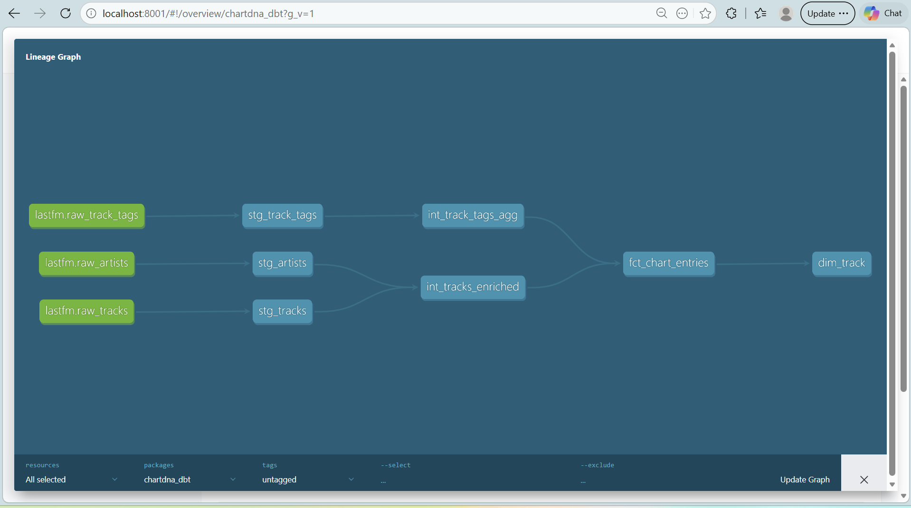
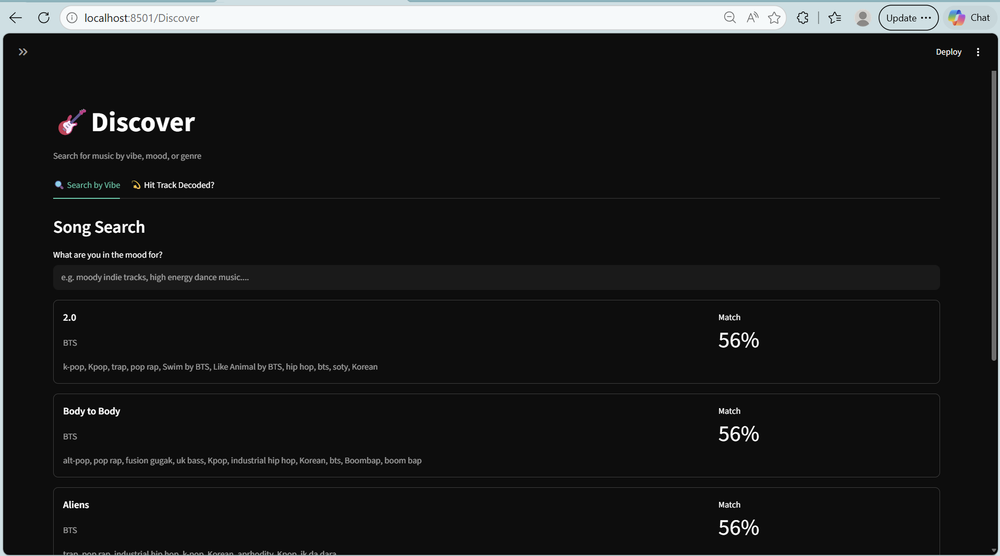
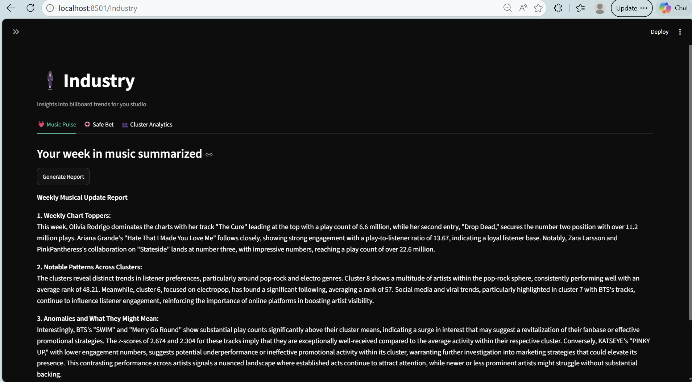
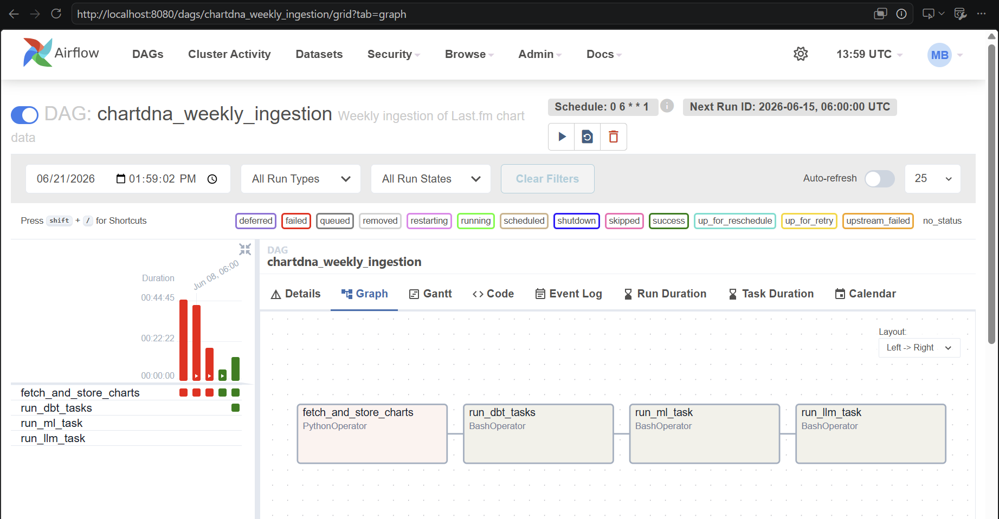
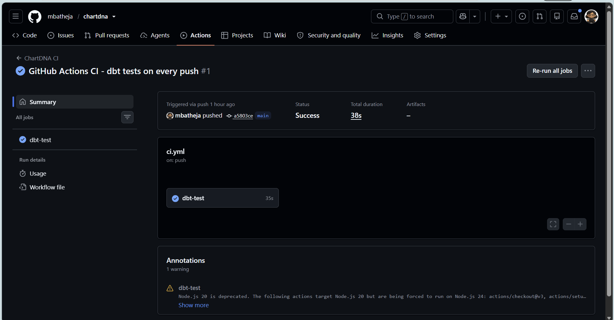

# ChartDNA — Music Intelligence Platform

> Decode the anatomy of a hit song. Weekly automated insights for music fans and A&R teams.


---

## What is ChartDNA?

ChartDNA is an end-to-end music analytics platform that ingests weekly chart data from Last.fm, transforms it through a tested data pipeline, applies ML clustering and anomaly detection, and surfaces insights via an LLM-powered API and Streamlit dashboard — updated automatically every Monday.

**Two audiences, one platform:**
- 👂🏻 **Music fans** — search for tracks by vibe ("moody indie"), discover similar songs, understand why a track is charting
- 👩🏻‍💼 **A&R / music executives** — weekly trend reports, safe-bet release recommendations, cluster analytics

---

## Architecture

```
Last.fm API (weekly)
      ↓
Airflow DAG (every Monday 6am)
      ↓
Raw landing (DuckDB)
      ↓
dbt: staging → intermediate → marts
      ↓
ML layer: clustering, similarity, anomaly detection
      ↓
LLM layer: trend reports, semantic search, explainers, safe-bet
      ↓
FastAPI backend → Streamlit dashboard
```

### dbt Lineage Graph


---

## Screenshots

### Discover Page (fan persona)


### Industry Page (A&R persona)


### Airflow DAG


### GitHub Actions CI


---

## Tech Stack

| Layer | Tools |
|---|---|
| Ingestion | Python, Last.fm API, Airflow |
| Storage | DuckDB |
| Transformation | dbt (staging → intermediate → marts) |
| ML | scikit-learn (TF-IDF, KMeans, cosine similarity) |
| LLM | OpenAI (GPT-4o-mini, text-embedding-3-small) |
| API | FastAPI, uvicorn |
| Dashboard | Streamlit |
| Infrastructure | Docker Compose |
| CI/CD | GitHub Actions |

---

## ML & LLM Features

### Tag Clustering
Groups 100+ weekly tracks into genre/vibe clusters using TF-IDF vectorization on crowdsourced Last.fm tags + KMeans clustering. Optimal cluster count selected via silhouette score.

### Anomaly Detection
Flags tracks with unusual play-to-listener ratios relative to cluster peers using per-cluster z-scores. Surfaces "hidden gems" (high engagement, lower rank) and underperformers.

### Semantic Search
Converts user queries ("moody indie tracks") and track tags into OpenAI embeddings, then finds the closest matches via cosine similarity — capturing meaning, not just keywords.

### Weekly Trend Report
LLM-generated narrative summarizing chart toppers, cluster patterns, and anomalies — grounded in real data, cached weekly, served via API.

### Track Explainer
Given a track, synthesizes its rank, cluster position, play-to-listener ratio, and anomaly status into a plain-English explanation of why it's performing the way it is.

### Safe Bet Recommender
Identifies clusters with low average rank, low rank variance, high weeks-on-chart, and high artist diversity — then generates a strategic recommendation for studios on what kind of music to release.

---

## Data Pipeline

### Raw tables (DuckDB)
- `raw_tracks` — weekly top 100 tracks from Last.fm
- `raw_artists` — artist metadata
- `raw_track_tags` — crowdsourced tags per track

### dbt models
- **Staging** — `stg_tracks`, `stg_artists`, `stg_track_tags` (cleaning, type casting)
- **Intermediate** — `int_tracks_enriched`, `int_track_tags_agg` (joins, tag deduplication, momentum scoring)
- **Marts** — `fct_chart_entries`, `dim_track` (star schema, analysis-ready)

### ML outputs (DuckDB)
- `ml_track_clusters` — cluster assignments per track
- `llm_track_embeddings` — OpenAI embeddings per track
- `llm_trend_reports` — cached weekly trend reports
- `llm_track_explanation` — cached per-track explanations

---

## API Endpoints

| Method | Endpoint | Description |
|---|---|---|
| GET | `/` | Health check |
| GET | `/trend-report` | Weekly Music Pulse narrative |
| GET | `/search?q=...` | Semantic track search |
| GET | `/explain?track=...&artist=...` | Track performance explainer |
| GET | `/safe-bet` | A&R strategic recommendation |
| GET | `/clusters` | Cluster breakdown data |

Interactive docs available at `http://localhost:8001/docs`

---

## Quick Start

### Prerequisites
- Docker Desktop
- OpenAI API key
- Last.fm API key

### Setup

```bash
git clone https://github.com/mbatheja/chartdna.git
cd chartdna
```

Create `.env`:
```
LASTFM_API_KEY=your_lastfm_key
OPENAI_API_KEY=your_openai_key
DB_PATH=/data/chartdna.duckdb
```

Start all services:
```bash
docker-compose up
```

Open:
- Streamlit dashboard: http://localhost:8501
- FastAPI docs: http://localhost:8001/docs
- Airflow UI: http://localhost:8080 (admin / admin123)

---

## Project Structure

```
chartdna/
├── ingestion/          # Last.fm API client + DuckDB ingestion
│   ├── lastfm_client.py
│   ├── fetch_charts.py
│   └── database.py
├── chartdna_dbt/       # dbt project
│   └── models/
│       ├── staging/
│       ├── intermediate/
│       └── marts/
├── ml/                 # ML layer
│   ├── tag_clustering.py
│   ├── similarity_search.py
│   └── anomaly_detection.py
├── llm/                # LLM layer
│   ├── context.py
│   ├── trend_report.py
│   ├── semantic_search.py
│   ├── track_explainer.py
│   └── safe_bet.py
├── api/                # FastAPI backend
│   └── main.py
├── app/                # Streamlit frontend
│   ├── Home.py
│   └── pages/
│       ├── 1_Discover.py
│       └── 2_Industry.py
├── airflow/            # Airflow DAGs
│   └── dags/
│       └── chartdna_weekly.py
├── Dockerfile
├── docker-compose.yml
└── .github/
    └── workflows/
        └── ci.yml
```

---

## CI/CD

GitHub Actions runs dbt schema tests on every push to `main`, catching data quality regressions before they reach production.

```yaml
on:
  push:
    branches: [main]
```
---

## Author

Mahima Batheja